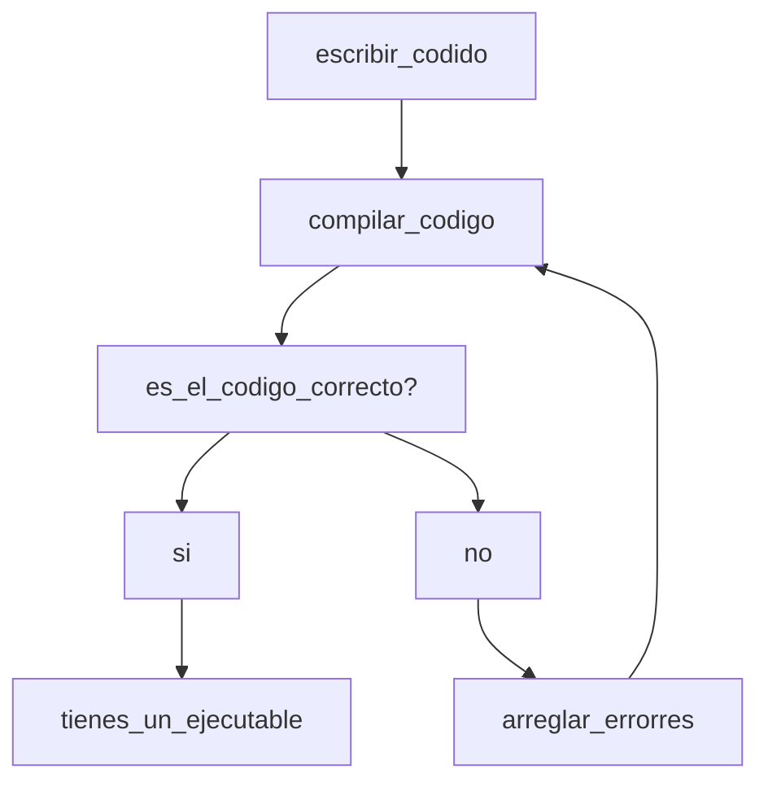

# Flujo de trabajo en un lenguaje compilado

```C++``` es un lenguaje de alto nivel, compilado de tipado estático fuerte, si estás comenzando en las ciencias de la computación, todo esto te puede sonar como palabrería asi que ¿Qué significa realmente todo esto?.


En este curso encontrará la respuesta a esta pregunta y muchas otras cosas, empecemos con alto nivel lo que esto significa es que el lenguaje de programación
es independiente de la arquitectura del computador en el que se ejecute.

Para generar un ejecutable hay una serie de pasos y software que es requerido, en términos generales el proceso es el siguiente:


Para hacer esto posible se requiere de un software especial, para propósitos de esta sección
hablaremos del linker y el compilador.


# ¿Qué es un compilador?

Según Laplante "The compiler bridges the semantic gap between the
high-level program that the user requires to be executed
and the low-level instructions that a computer can understand" [[1]](1) en otras palabras el compilador
"traduce" el código a una arquitectura específica (que en este caso es x86), el compilador a utilizar en este curso es gcc.

# ¿Comó instalar gcc?

Asumiendo que se esta usando Ubuntu (es un requisito), se deben ejecutar los siguientes comandos en la terminal, en el orden que se muestra a continuación:
```bash
sudo apt-get update && sudo apt-get upgrade
```
```bash
sudo apt-get install gcc g++
```
Si encuentra problemas en la instalación, se le aconseja leer la salida de la termina, esta le dará pistas sobre por que no funciona el comando ejecutado.
# Nuestro primer programa

En esta carpeta cree una nueva carpeta llamada ```test``` (esta carpeta sera ignorada por git), dentro cree
un archivo llamado main.cpp (lo usual es llamar main al punto de entrada principal de nuestro programa),
el codigo en c++ se encuentra en archivos con la siguiente nomenclatura .ccp y .hpp , el segundo se refiere a archivos de fichero (aquí es donde normalmente se definen las bibliotecas), por ahora escriba
lo siguiente en el archivo:

```cpp
#include <iostream>

int main(){
	std::cout << "Hello world"!;
	return 0;
}
```
Después de esto ejecute lo siguiente en la terminal:

```bash
g++ main.cpp -o main
```
Notará que aparece un nuevo archivo dentro de la carpeta, este es el ejecutable correspondiente al programa. También preste atención a la primera columna de las letras, esto corresponde a las operaciones permitidas para el archivo, puede encontrar más sobre esto en [[2]](2). Ahora escriba lo siguiente en la terminal:
```bash
./main
```
Debería obtener la siguiente salida:  "Hello World", preste atención
a la primera línea del código, tiene lo siguiente:
```#include <iostream>``` con esto lo que querimos decir es que hacemos una llamada al header iostream de la biblioteca estandar de c++.
# Primer archivo de ficheros.
Ahora cree un archivo llamado myheader.hpp y escriba lo siguiente en el
```cpp
#include <iostream>

void hello(){
	std::cout << "Hello me" << std::endl;
	return;
}
```
Luego agregue esto en el archivo main.cpp, de manera que se vea de la siguiente manera.
```cpp
#include <iostream>
#include "myheader.hpp"

int main(){
	std::cout << "Hello world" << std::endl;
	hello();
	return 0;
}
```
Ahora en la terminal escriba lo siguiente:
```bash
g++ main.cpp myheader.hpp -o main
./main
```
Debió obtener la siguiente salida:
```
Hello world
Hello me
```
Lo anterior es el proceso por el cual se añade un header file al proceso de compilacion. Cabe  mencionar 
 que al escribir header files, se deben tomar en cuenta los header guards pero por razones de simplicidad este tema se tocará en el futuro.

## Referencias
<a id="1">[1]</a>
Philllip A. Laplante
Enciclopedia of Computer Science and Technology Second Edition Volume I, p233.

<a id="2">[2]</a>
https://www.guru99.com/file-permissions.html .
